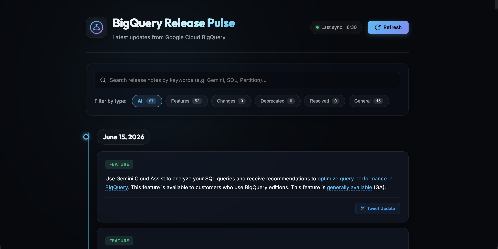

# BigQuery Release Pulse

An ultra-modern, highly aesthetic dashboard application that aggregates, filters, and shares Google Cloud BigQuery release updates. Built with **Python Flask** and **Vanilla Web Technologies** (HTML5, CSS3, ES6 JavaScript).

---

## 🎨 Preview

The dashboard features a glassmorphic timeline layout with real-time fuzzy search, update filters, and a custom Tweet composer:



---

## ✨ Key Features

- 🔄 **Real-Time Synchronisation**: Fetch live updates directly from the official Google Cloud BigQuery Release Notes feed.
- 🧩 **Granular Update Parsing**: Splits aggregated daily release notes into separate cards classified by type (e.g., *Feature*, *Changed*, *Deprecated*, *Resolved*).
- 🔍 **Fuzzy Live Search**: Instant search matching date, type, or description keywords without reloading the page.
- 🏷️ **Dynamic Category Filtering**: Filter release notes using active status badges which show numerical update counts dynamically.
- 🐦 **Custom Tweet Composer**: Select any release note update to prefill a custom composition modal. Features a dynamic 280-character limit tracker and progress bar before launching Twitter/X Web Intent.
- ⚡ **Caching Layer**: Built-in 5-minute in-memory caching to avoid feed throttling and improve speed.
- 🔔 **Toast Notification Engine**: Animated status updates (success, error, information alerts) in the viewport.

---

## 🛠️ Technology Stack

- **Backend**: Python 3, Flask (lightweight web server), XML ElementTree (RSS/Atom parsing)
- **Frontend**: Plain Semantic HTML5, Vanilla CSS3 (custom properties, radial gradients, glassmorphic filters, responsive layout), ES6+ JavaScript (Fetch API, MVC state management)

---

## 🚀 Quick Start & Installation

### Prerequisites
Make sure you have Python 3 and `pip` installed:
```bash
python3 --version
```

### 1. Clone & Navigate
Navigate to your project directory:
```bash
cd event-talks-app
```

### 2. Install Dependencies
Install Flask if you haven't already:
```bash
pip install Flask
```

### 3. Run the App
Launch the Flask development server:
```bash
python3 app.py
```
By default, the server runs on port `5001`. Open your browser and navigate to:
**[http://127.0.0.1:5001]**

---

## 📁 Project Structure

```
event-talks-app/
│
├── app.py              # Flask server and XML feed parsing logic
├── README.md           # Documentation
├── .gitignore          # Git exclusion rules
│
├── templates/
│   └── index.html      # Responsive dashboard UI layout
│
└── static/
    ├── app.js          # MVC client-side controller (search, filter, composer)
    └── style.css       # Premium CSS design system & animations
```

---

## 🔗 Official Resources

- **XML RSS/Atom Feed**: [BigQuery Release Notes XML](https://docs.cloud.google.com/feeds/bigquery-release-notes.xml)
- **Google Cloud Documentation**: [BigQuery Release Notes Page](https://cloud.google.com/bigquery/docs/release-notes)
- **Twitter Web Intent documentation**: [X Developer Resources](https://developer.x.com/)
